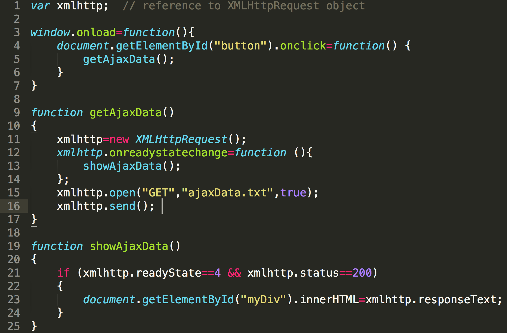
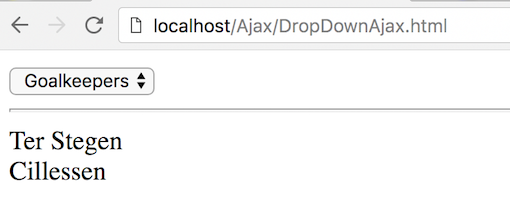

# Ajax Exercise 1 – Hello Ajax
		
> Note:: Complete ALL the exercises in this section.  If you need help email ``thomas.devine@lyit.ie`` or post an *Issue* on your private GitHub repository.

## Clone the Remote Repository

1.	Accept the GitHub Classroom invitation to this exercise at the module moodle page

1.	Copy the clone URL from your new repository ``Ajax-<YOURACCOUNT>``

1.	Type these commands into your *Git Bash* client:

	```
	$ cd /<DRIVE>/xampp/htdocs   
	$ git clone <URL> Ajax
	$ cd Ajax
	$ ls
	$ git status

	```

Check your ``htdocs`` folder.  You should have a new folder called ``Ajax`` with some files in it.


## Part 1 – Hello Ajax

1.	Using the *Sublime Text Editor* examine the HTML file called ``HelloAjax.html`` in your ``Ajax`` folder.  Notice it has a companion JavaScript file called ``HelloAjax.js``.

1.	Open the file ``HelloAjax.js`` and add the code below to it:

	

	This code will wait until you press the button and then perform the Ajax request.

1.	Lastly, look at the contents of the file ``ajaxData.txt``.  This is the data you will request using Ajax from the web server.

1.	Run the code by opening the HTML file [http://localhost/Ajax/HelloAjax.html](http://localhost/Ajax/HelloAjax.html).  You should see *hello, world!* when you click the button.


## Part 2 – More Ajax

1.	The Figure below shows a HTML page ``DropdownAjax.html`` with a dropdown box that has options:

	```
	Choose type...
	Goalkeepers
	Defenders
	Midfielders
	Forwards

	```

	

	Write the code in a JavaScript program ``DropdownAjax.js`` that retrieves the appropriate data for the player type selected from either of the corresponding files – ``goalkeepers.txt``, ``defenders.txt``, ``midfielders.txt`` and ``forwards.txt`` - and displays that data on the HTML page.

	The players are:

	```
	-Goalkeepers -
	Ter Stegen
	Cillessen

	-Defenders -
	Pique
	Umtiti
	S. Roberto
	Alba

	-Midfielders -	
	Iniesta
	Rakitic
	Busquets
	Coutinho

	-Forwards -
	Messi
	Dembele
	Suarez
	
	```
